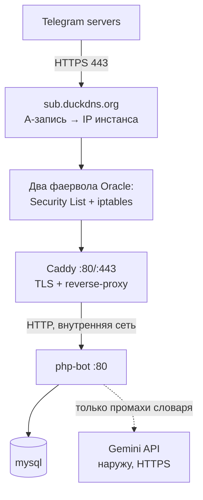

# Деплой: как это работает и почему

Документ объясняющий, а не «список команд». Цель — чтобы после деплоя ты понимал,
из чего он состоит, и мог починить его сам, когда что-то отвалится.

Конкретный стенд: Oracle Cloud Free Tier (ARM-инстанс) + поддомен на DuckDNS + Docker
Compose + Caddy как reverse-proxy с автоматическим HTTPS.

---

## 0. Матчасть

### Сокеты, порты, listen

TCP-соединение идентифицируется пятёркой `(proto, src_ip, src_port, dst_ip, dst_port)`.
Серверный процесс делает `bind()` на пару «интерфейс + порт» и `listen()`. Отсюда
принципиальная разница, которую регулярно упускают:

- `bind 127.0.0.1:8000` — сокет доступен только с loopback, снаружи его нет вообще,
  никакой фаервол не нужен;
- `bind 0.0.0.0:8000` — на всех интерфейсах, включая публичный.

**Внутри контейнера `0.0.0.0` — это все интерфейсы его собственного network namespace,
а не хоста.** Поэтому контейнер сам по себе снаружи не виден. Наружу его выставляет
`ports:` в compose (publish): Docker добавляет DNAT-правило в `nat/PREROUTING` и разрешающее
правило в `FORWARD`, а для loopback подставляет `docker-proxy`.

Практическое следствие, которое стоит знать до того, как обожжёшься: **published-порты
не проходят через цепочку `INPUT`**. Твои правила `INPUT` (и UFW) их не фильтруют — трафик
идёт через `FORWARD`/`DOCKER`. Ограничивать доступ к контейнерам надо в цепочке `DOCKER-USER`,
либо просто не публиковать порт. `ports: "3306:3306"` у MySQL — это MySQL в интернете,
независимо от того, что написано в `INPUT`.

Порты ниже 1024 — привилегированные, для bind нужен root или `CAP_NET_BIND_SERVICE`.
В нашем случае это забота Caddy (80/443), внутри контейнера он это умеет.

Смотреть, кто что слушает: `ss -tlnp`.

### DNS

Иерархический распределённый каталог с агрессивным кэшированием. Резолв идёт
root → TLD → authoritative-сервер зоны; на практике за клиента это делает рекурсивный
резолвер (провайдера, systemd-resolved, 8.8.8.8).

Что нужно из типов записей:

| Тип | Что делает |
|---|---|
| `A` / `AAAA` | имя → IPv4 / IPv6. Нам нужен `A` |
| `CNAME` | алиас на другое имя. Нельзя на apex-домене вместе с другими записями |
| `NS` | делегирование зоны |
| `TXT` | произвольные данные; в частности ACME DNS-01, SPF |

Два свойства, из которых растут почти все проблемы:

- **TTL — это контракт на кэширование**, а не рекомендация. Пока не истёк, резолверы
  отдают старый ответ. Плюс есть **negative caching** (по `SOA minimum`): ответ NXDOMAIN
  тоже кэшируется, поэтому опечатка «залипает» дольше, чем ожидаешь. У DuckDNS TTL 60 с.
- **DNS не участвует в доставке трафика.** Он только резолвит имя в адрес и ничего
  не гарантирует. «Резолвится» ≠ «работает» — это разные уровни, и путать их нельзя.

Диагностика — `dig`, а не `nslookup` (тот легаси и врёт про источник ответа):

```bash
dig +short mybot.duckdns.org       # что отдаёт локальный резолвер
dig @8.8.8.8 mybot.duckdns.org     # в обход локального кэша
dig +trace mybot.duckdns.org       # весь путь делегирования
```

**DuckDNS** — authoritative-зона с HTTP-API для обновления A-записи, то есть классический
dynamic DNS. Даёт имя третьего уровня бесплатно; покупать домен не требуется.

### Пакетный фильтр

В Linux это **netfilter**, интерфейс к нему — `iptables`/`nftables`. Таблицы `filter`,
`nat`, `mangle`; цепочки `INPUT` (пакеты, адресованные самому хосту), `FORWARD`
(транзитные — сюда попадает трафик к контейнерам), `OUTPUT`, плюс `PREROUTING`/`POSTROUTING`
в `nat`.

Что важно помнить:

- **Фильтр stateful.** Соединения отслеживает `conntrack`, и в начале цепочки почти всегда
  стоит `-m conntrack --ctstate ESTABLISHED,RELATED -j ACCEPT`. Поэтому ответы на исходящие
  соединения разрешать отдельно не надо — разрешаешь только новые входящие.
- **Правила проверяются по порядку, побеждает первое совпадение.** В Oracle-образах в конце
  `INPUT` стоит `REJECT all`, поэтому новое правило вставляют через `-I INPUT <n>`, а не
  дописывают `-A` — после REJECT оно мертво. Смотреть номера: `iptables -L INPUT -n --line-numbers`.
- **DROP и REJECT различаются диагностически.** DROP молча выбрасывает пакет: клиент шлёт SYN,
  ретрансмитит и получает **таймаут**. REJECT отвечает TCP RST или ICMP unreachable — клиент
  сразу видит **connection refused**. Это первое, что различают при разборе «не коннектится»:
  таймаут → фильтр на пути, refused → до хоста дошли, но никто не слушает.
- **Правила живут в памяти.** Без `netfilter-persistent save` они исчезнут после ребута.

**Oracle Security List / NSG** — тот же stateful-фильтр, но на уровне виртуальной сети,
до NIC инстанса. То есть фильтров два, независимых, и оба по умолчанию закрыты:

```
интернет → [Security List / NSG в VCN] → [netfilter внутри Ubuntu] → сокет
```

Закрытый любой из них даёт таймаут (оба DROP-подобные). Разделяем так: с самого сервера
`curl -v localhost:80` — если изнутри работает, а снаружи таймаут, дело в фильтрах;
если и изнутри нет — приложение не слушает, смотри `ss -tlnp`.

### TLS и сертификаты

HTTPS — это HTTP поверх TLS (SSL — предыдущее поколение того же, название осталось
в обиходе и в именах опций). Что происходит при установке соединения:

1. `ClientHello`: клиент присылает поддерживаемые шифры, **SNI** (имя запрашиваемого хоста
   открытым текстом) и ALPN (`h2`/`http/1.1`).
2. Сервер отдаёт **цепочку сертификатов** — свой лист + промежуточные, до корня,
   который уже есть в trust store клиента.
3. Ключи сессии согласуются через ECDHE — это даёт **forward secrecy**: компрометация
   приватного ключа сервера не расшифровывает записанный ранее трафик. Сертификат при этом
   используется для **аутентификации** сервера (подпись), а не для шифрования данных.
4. Дальше данные идут симметричным AEAD-шифром (AES-GCM / ChaCha20-Poly1305).
   В TLS 1.3 всё это укладывается в 1-RTT.

**Сертификат связывает доменное имя (поле SAN) с публичным ключом**, а подпись CA делает
эту связь доверенной. Клиент валидирует: совпадение имени, срок, цепочку до доверенного
корня, отзыв. Поэтому сертификат выпускается на имя, а не на IP — из чего и следует порядок
шагов: сначала DNS, потом TLS.

SNI, кстати, объясняет, почему один IP спокойно обслуживает много доменов: сервер узнаёт
запрошенное имя ещё до выбора сертификата.

**Let's Encrypt** — CA, выдающий DV-сертификаты бесплатно по протоколу **ACME**. Срок
жизни 90 дней — сознательное решение, чтобы продление в принципе не могло быть ручным.
Валидация владения доменом:

- **HTTP-01** — CA запрашивает `http://<домен>/.well-known/acme-challenge/<token>`.
  Требует открытый 80 и рабочий DNS. Wildcard так не получить.
- **DNS-01** — TXT-запись `_acme-challenge.<домен>`. Единственный вариант для wildcard
  и когда 80 недоступен.

О rate limits стоит помнить заранее: у LE есть лимит на неудачные валидации, и цикл
«рестартую, пока не заработает» упирается в него быстро. Для отладки — staging-эндпоинт LE.
`duckdns.org` входит в Public Suffix List, так что лимиты считаются по твоему поддомену,
а не размазываются на всех пользователей DuckDNS.

Telegram шлёт вебхуки только на валидный публичный HTTPS — самоподписанный формально
поддерживается (загрузкой `.pem` в `setWebhook`), но это лишняя сущность, когда LE
автоматизирован.

### Reverse-proxy и Caddy

Reverse-proxy — L7-посредник на стороне сервера: терминирует клиентские соединения
и проксирует их на апстримы. Что он реально даёт здесь:

- **TLS termination в одной точке.** Апстрим (`php`) говорит по plain HTTP
  во внутренней сети и ничего не знает про сертификаты. Один компонент умеет ACME —
  остальные не переписываются.
- **Сокращение attack surface.** Наружу опубликован один сервис; MySQL и Adminer
  вообще не имеют published-портов и достижимы только внутри compose-сети.
- **Маршрутизация по L7** — по хосту и пути: `/` → PHP, `/webapp/` → статика.
  Снаружи один origin, что заодно снимает вопрос CORS.
- **Буферизация и защита медленного апстрима.** Прокси принимает запрос целиком и только
  потом идёт в апстрим, держит keep-alive со своей стороны. Для однопоточного `php -S`
  это критично: без буферизации любой медленный клиент (slowloris) занимает единственного
  воркера.

Апстрим при этом видит адрес прокси, а не клиента, — реальный IP и схема передаются
заголовками `X-Forwarded-For` / `X-Forwarded-Proto`, и приложение должно им доверять
только от известного прокси.

**Caddy vs nginx.** Функционально оба закрывают задачу; Caddy отличается тем, что ACME
у него встроен в ядро — автоматический выпуск, продление, OCSP stapling, редирект 80→443
без конфигурации. Nginx даёт больше контроля и вокруг него больше экспертизы, но за
сертификаты там отвечает отдельный certbot с таймером. Для одного домена и одного апстрима
разница в объёме конфига — три строки против экрана.

### Docker и Compose

Контейнер — не виртуалка: это процесс на **общем с хостом ядре**, изолированный
**namespaces** (pid, net, mnt, uts, ipc) и ограниченный **cgroups**. Отсюда прямое следствие
для нас: раз ядро общее, инструкции процессора не эмулируются — на ARM-инстансе нужны
**arm64-образы**, amd64 просто не запустится (или пойдёт через qemu с катастрофической
скоростью).

- **Образ** — набор read-only слоёв (OverlayFS), собранных по `Dockerfile`; каждая инструкция
  даёт слой, слои кэшируются и переиспользуются. **Контейнер** — образ плюс тонкий
  writable-слой сверху, который умирает вместе с контейнером.
- **Compose** поднимает сервисы в user-defined bridge-сети со встроенным DNS (`127.0.0.11`),
  резолвящим **имена сервисов**. Поэтому в конфигах `mysql`, `php`, а не IP:
  адреса контейнеров меняются при пересоздании.
- **Named volume** (`mysql_data`) живёт вне жизненного цикла контейнера — это и есть
  персистентность БД. `docker compose down` контейнеры удаляет, тома оставляет;
  `down -v` удаляет и тома, то есть базу.
- **Bind mount** (`./php:/var/www/html`) монтируется поверх содержимого образа и **маскирует**
  его. Именно поэтому `composer install`, выполненный на этапе сборки, «пропадает»:
  каталог из образа перекрыт хостовым.

### SSH

Аутентификация по паре ключей вместо пароля: клиент подписывает приватным ключом данные,
привязанные к конкретной сессии, сервер проверяет подпись по `~/.ssh/authorized_keys`.
Публичный ключ туда кладёт cloud-init при создании инстанса. Пароль по сети не передаётся
вообще, брутфорс невозможен.

Обратное направление тоже аутентифицируется: **host key** сервера сверяется с `known_hosts` —
это защита от MITM, и именно поэтому смена host key вызывает громкое предупреждение.

```bash
chmod 600 <ключ>            # иначе ssh откажется его использовать
ssh -i <ключ> ubuntu@<public-ip>
```

Приватный ключ эквивалентен полному доступу к серверу: в Oracle он выдаётся один раз
при создании инстанса и повторно не скачивается.

---

## 1. Что вообще меняется при переезде с ноутбука на сервер

Локально всё держалось на ngrok. Смысл ngrok такой: у твоего ноутбука нет публичного
IP и нет TLS-сертификата, а Telegram умеет слать вебхуки **только на публичный HTTPS-адрес**.
ngrok поднимал туннель наружу и давал временный `https://xxxx.ngrok-free.app`, который
менялся при каждом рестарте — поэтому контейнер `init` каждый раз заново переустанавливал
webhook.

На сервере всё это не нужно, потому что появляются три вещи, которых не было:

| Чего не хватало локально | Что даёт сервер |
|---|---|
| Публичный IP | У инстанса Oracle он свой и постоянный |
| Постоянное имя | DuckDNS: `<sub>.duckdns.org` → этот IP |
| TLS-сертификат | Caddy выпускает Let's Encrypt сам и продлевает автоматически |

Отсюда главное следствие: **webhook Telegram теперь ставится один раз в жизни**, а не при
каждом `up`. Логика «подожди ngrok, вытащи URL из его API, переставь webhook» уходит целиком.

---

## 2. Из каких слоёв состоит деплой

Стоит держать в голове именно как слои — когда что-то не работает, ты по очереди
проверяешь их снизу вверх.



1. **Машина** — где всё крутится (Oracle инстанс).
2. **Сеть** — IP, порты, фаерволы.
3. **Имя** — DNS, чтобы к IP можно было обратиться по имени (сертификат выдаётся на имя,
   а не на IP — без DNS не будет HTTPS).
4. **TLS + маршрутизация** — Caddy: терминирует HTTPS и раскидывает запросы по контейнерам.
5. **Приложение** — docker compose со всеми сервисами.
6. **Эксплуатация** — автозапуск после ребута, логи, бэкапы, обновление кода.

---

## 3. Шаги

### 3.1. Инстанс Oracle

Форма Create compute instance, поля по порядку:

| Поле | Значение | Почему |
|---|---|---|
| Name | `money-bot` | дефолт вида `instance-20260806-1806` ничего не говорит |
| Image | **Canonical Ubuntu 22.04** | Oracle Linux 9 — это `firewalld` и `dnf`; вся документация и ответы в сети под Ubuntu |
| Shape | `VM.Standard.E2.1.Micro` (AMD, 1 GB) или Ampere `A1.Flex` 4 OCPU / 24 GB | см. ниже — после отказа от локальной модели хватает micro |
| Capacity type | On-demand | preemptible отбирают в любой момент и он не Always Free |
| Boot volume | 50–100 GB | дефолтных ~47 GB хватает; бесплатный лимит 200 GB на все тома |
| Networking | новый VCN, публичная подсеть, **Assign a public IPv4 address** | без публичного IP инстанс недостижим |
| SSH keys | свой публичный ключ или «Generate a key pair for me» | приватный ключ отдаётся **один раз** |
| Restore instance lifecycle state | включено | после планового обслуживания инстанс сам вернётся в running |

Про shape. Раньше выбора не было: `classify-api` держал в памяти
`xlm-roberta-large-xnli` — несколько гигабайт весов, в 1 GB не влезает физически,
и оставался только Ampere. После переезда классификации в Gemini API python-сервиса
нет вообще, и бюджет памяти выглядит так:

| компонент | RAM |
|---|---|
| PHP 8.2 (встроенный сервер) | ~80 MB |
| MySQL с зажатым `innodb_buffer_pool_size=128M` | ~300 MB |
| Caddy | ~30 MB |
| Ubuntu | ~200 MB |
| **итого** | **~600 MB** |

То есть **`VM.Standard.E2.1.Micro` (1 GB) подходит**, а его в Always Free дают до двух
штук и дефицита по нему нет — в отличие от A1, который разбирают. Это же снимает
требование arm64: micro — это AMD, обычный x86.

Что учесть на 1 GB:

- **Своп 2 GB обязателен.** `docker compose up --build` с `composer install` без него
  ловит OOM: `fallocate -l 2G /swapfile && chmod 600 /swapfile && mkswap /swapfile &&
  swapon /swapfile`, затем строка в `/etc/fstab`.
- **MySQL зажать явно** или взять `mariadb:11` — она заметно скромнее по умолчанию.
- **Инстансов можно два.** Если тесно, PHP на одном, MySQL на другом — оба бесплатны.

A1 остаётся лучшим вариантом, если он вдруг доступен: 4 OCPU / 24 GB и запас на будущее.
Квота на ARM считается суммарно на аккаунт, поэтому брать меньше 4/24 в единственном
инстансе смысла нет. Плата за него — **arm64 вместо x86**: все образы в compose обязаны
иметь arm64-сборку (см. «Ловушки»).

**Проверить ёмкость до попытки создания** — `compute-capacity-report`. Отвечает
`AVAILABLE` / `OUT_OF_HOST_CAPACITY` по каждому shape за секунду, вместо ретраев вслепую:

```powershell
$shapes = '[{"instanceShape":"VM.Standard.A1.Flex","instanceShapeConfig":{"ocpus":1,"memoryInGBs":6}},{"instanceShape":"VM.Standard.E2.1.Micro"}]'
$f = Join-Path $env:TEMP 'shapes.json'; Set-Content $f $shapes -Encoding ascii
oci compute compute-capacity-report create -c <tenancy-ocid> --availability-domain <ad> `
    --shape-availabilities ('file://' + ($f -replace '\\','/')) `
    --query 'data.\"shape-availabilities\"[].{shape:\"instance-shape\",status:\"availability-status\"}' --output table
```

Полезно ещё до регистрации: если в регионе пусто по всем Always Free shape
(и `A1.Flex`, и `E2.1.Micro`), ждать бессмысленно — там нет свободного железа вообще,
и надо либо другой регион, либо другой провайдер.

**«Out of host capacity»** — самая частая проблема с A1, Ampere разбирают. Консоль сама
не повторяет попытку, поэтому в репозитории лежит `oci-retry-launch.ps1`: он раз в минуту
дёргает `oci compute instance launch` и создаёт инстанс, как только ёмкость освободится.
Требует настроенный OCI CLI и уже созданные VCN с публичной подсетью.

Что ещё влияет на шансы: апгрейд аккаунта до Pay As You Go (Always Free ресурсы при этом
остаются бесплатными), меньший размер инстанса — 2 OCPU / 12 GB пролезает там, где нет места
под 4, и `A1.Flex` потом можно увеличить через stop → Edit shape. Между availability domain
переключаться можно не везде: в ряде регионов (например ME-DUBAI-1) AD всего одна.

Ключ и вход:

```bash
ssh-keygen -t ed25519 -C oracle-money-bot   # если генерируешь сам
chmod 600 <приватный-ключ>
ssh -i <приватный-ключ> ubuntu@<public-ip>
```

Публичный IP по умолчанию **ephemeral**: переживает перезагрузку, но меняется при
пересоздании инстанса. Его можно превратить в reserved (Networking → Reserved public IPs);
для нашей схемы не критично — при смене IP достаточно обновить A-запись в DuckDNS.

### 3.2. Порты: почему их надо открывать дважды

Самая частая потеря времени на Oracle. Трафик до приложения проходит **два независимых
фаервола**, и оба по умолчанию закрыты:

1. **Security List (или NSG) в VCN** — облачный фаервол, живёт в веб-консоли Oracle.
   Networking → VCN → Subnet → Security List → Add Ingress Rule: `0.0.0.0/0`, TCP, порт 80 и 443.
2. **iptables внутри самой Ubuntu** — Oracle кладёт в свои образы жёсткий набор правил
   (в отличие от обычной Ubuntu, где всё открыто).

```bash
sudo iptables -I INPUT 6 -p tcp --dport 80  -j ACCEPT
sudo iptables -I INPUT 6 -p tcp --dport 443 -j ACCEPT
sudo netfilter-persistent save   # иначе правила исчезнут после ребута
```

`-I INPUT 6` — вставить правилом номер 6, а не в конец: в конце цепочки стоит `REJECT all`,
и правило после него никогда не сработает. Проверить порядок: `sudo iptables -L INPUT -n --line-numbers`.

Нюанс, про который стоит помнить (см. раздел 0): у Caddy порты **published из контейнера**,
а такой трафик идёт через `FORWARD`/`DOCKER`, а не через `INPUT` — то есть правила выше
на него, скорее всего, и не влияют, порт откроется и без них. Ставим их всё равно: они нужны
для всего, что слушает на хосте, и чтобы состояние фильтра было предсказуемым. Обратная
сторона той же механики: `INPUT` не защитит опубликованный порт MySQL — защита здесь одна,
не публиковать его вовсе.

Диагностика «снаружи не открывается»: `curl -v localhost:80` с самого сервера работает,
а снаружи таймаут → фильтры. Не работает и локально → смотри `ss -tlnp`, приложение
не слушает.

### 3.3. DNS через DuckDNS

DuckDNS — бесплатный динамический DNS. Ты получаешь `<sub>.duckdns.org` и указываешь,
на какой IP он должен смотреть.

«Динамический» — потому что изначально он для домашних машин с меняющимся IP: там ставят
крон, который раз в 5 минут дёргает `https://www.duckdns.org/update?domains=<sub>&token=<token>&ip=`
и обновляет запись. У Oracle IP статический (если выбран reserved public IP), поэтому достаточно
один раз вписать его в веб-форме DuckDNS. Крон можно поставить для страховки — он идемпотентен.

Проверка:

```bash
nslookup <sub>.duckdns.org
```

Должен вернуть IP инстанса. **Пока это не работает, дальше идти бессмысленно** — Let's Encrypt
не выдаст сертификат.

### 3.4. Docker на сервере

```bash
curl -fsSL https://get.docker.com | sudo sh
sudo usermod -aG docker ubuntu      # чтобы не писать sudo перед каждой командой
newgrp docker                       # применить группу без релогина
```

`docker compose` (v2, через пробел) идёт в комплекте — отдельный `docker-compose` ставить не надо.

### 3.5. Код и секреты на сервер

Код — через `git clone` своего репозитория. Не rsync с ноутбука: так ты всегда знаешь,
какая ревизия развёрнута (`git log -1` на сервере), и обновление сводится к `git pull`.

Секреты в git не едут, их создаём на сервере из шаблона:

```bash
cp .env.prod.example .env
chmod 600 .env
nano .env          # PUBLIC_DOMAIN, TELEGRAM_BOT_TOKEN, GEMINI_API_KEY, MYSQL_ROOT_PASSWORD
```

Пароль root для MySQL — `openssl rand -base64 24`. Он задаётся **при первом создании
тома** `mysql_data`; поменять значение в `.env` потом мало — пароль в базе от этого
не изменится, сломается только подключение.

`NGROK_AUTHTOKEN` больше не нужен. `start-docker.bat` и корневой `config.txt` — это
Windows-обвязка для локальной разработки, на сервере они не используются вообще.
`php/config.txt` в проде тоже не создаётся: домен постоянный, а секреты приходят
в окружение контейнера, откуда `Cfg` их и читает при отсутствии файла.

### 3.6. Caddy: reverse-proxy и автоматический HTTPS

Единственный сервис с published-портами (80, 443). Терминирует TLS, проксирует на `php`,
всё остальное остаётся внутри compose-сети. Механика — в разделе 0.

Практически важно то, что вытекает из HTTP-01: Caddy при старте запрашивает сертификат,
и LE в этот момент стучится на `http://<домен>/.well-known/acme-challenge/<token>`. Отсюда
два предусловия, на которых обычно и спотыкаются:

- **порт 80 должен быть открыт**, даже если наружу планируется только 443;
- **DNS уже должен резолвиться** в этот сервер к моменту первого запуска.

Если запустить раньше — валидации будут падать, а неудачные попытки считаются в rate limit
Let's Encrypt. Отлаживать конфиг лучше на их staging-эндпоинте (`acme_ca` в Caddyfile).

Минимальный `Caddyfile`:

Конфиг лежит в репозитории — [`Caddyfile`](Caddyfile), домен подставляется из
`PUBLIC_DOMAIN`. Внутри compose Caddy обращается к контейнеру по имени сервиса
(`php`), потому что Docker поднимает свой DNS во внутренней сети.

### 3.7. Прод-версия compose

Готова: [`docker-compose.prod.yml`](docker-compose.prod.yml).

```bash
docker compose -f docker-compose.prod.yml up -d --build
```

Отдельный файл, а не override: override умеет добавлять и менять сервисы, но **не
удалять**, а `ngrok` должен исчезнуть целиком. Чем отличается от локального:

- **Нет `ngrok`.** Домен постоянный.
- **`ports:` только у Caddy** (80, 443). Секция `ports` открывает порт на публичном
  интерфейсе машины — на сервере это дыра. Контейнеры и так видят друг друга по именам
  внутри сети compose. Adminer оставлен, но привязан к `127.0.0.1`, то есть доступен
  только через SSH-туннель:
  `ssh -i ~/.ssh/oracle-money-bot.key -L 8080:localhost:8080 ubuntu@<ip>`.
- **Нет bind mount `./php`.** Локально он удобен (правки видны сразу), в проде —
  вреден: перекрывает `/var/www/html` вместе с `vendor/`, установленным при сборке.
  Код едет внутри образа, обновление — `git pull && up -d --build`.
- **`restart: unless-stopped`** на всех сервисах, кроме `init`. Это и есть «автозапуск»:
  отдельный systemd-юнит не нужен, демон Docker стартует при загрузке и поднимает
  контейнеры с этой политикой. У `init` стоит `restart: "no"`, чтобы не дёргать
  Telegram на каждом ребуте.
- **`init` упрощён**: дожидается, пока Caddy выпустит сертификат (curl по своему же
  домену), ставит webhook и кнопку меню — и выходит. `config.txt` не пишет.
- **MySQL зажат под 1 GB**: `--performance-schema=OFF` (сам по себе держит сотни
  мегабайт), `--innodb-buffer-pool-size=128M`, `--max-connections=30`. Плюс
  healthcheck — на медленном инстансе первый старт долгий, а `php` без готовой базы
  падает с фатальной ошибкой, поэтому он ждёт `service_healthy`.
- **Логи ограничены** 10 MB × 3 на сервис: json-драйвер Docker по умолчанию растёт
  без предела и молча съедает диск.

`php/.dockerignore` не пускает в образ хостовые `config.txt` (он перебил бы чтение
настроек из окружения) и `vendor/` (его тут же перезапишет `composer install`,
а копирование на 1 GB стоит минут сборки).

### 3.8. Webhook Telegram

```bash
curl -X POST "https://api.telegram.org/bot$TOKEN/setWebhook" \
     -d "url=https://<sub>.duckdns.org"

curl -X POST "https://api.telegram.org/bot$TOKEN/setChatMenuButton" \
     -H "Content-Type: application/json" \
     -d '{"menu_button":{"type":"web_app","text":"Расходы",
          "web_app":{"url":"https://<sub>.duckdns.org/webapp/"}}}'
```

Проверка состояния — главный инструмент диагностики «бот молчит»:

```bash
curl "https://api.telegram.org/bot$TOKEN/getWebhookInfo"
```

Смотреть на `last_error_message` и `pending_update_count`. Telegram честно пишет, что у него
не получилось: невалидный сертификат, 502, таймаут. Если `url` пустой — webhook слетел.

Важно: у одного бота **один** webhook. Пока он смотрит на прод, локальная разработка через
ngrok на том же токене невозможна — они будут перебивать друг друга. Для локалки заводится
второй бот у @BotFather.

---

## 4. Ловушки конкретно этого проекта

- **`mysql:5.7` не существует под arm64.** Официальный образ 5.7 собран только под amd64,
  на Ampere он не запустится. Нужен `mysql:8.0-oracle` (есть arm64) или `mariadb:11`.
  Переход на 8.0 — это ещё и смена дефолтного плагина аутентификации на `caching_sha2_password`;
  PDO из PHP 8.2 его умеет, но подключение стоит проверить сразу.
- **Схема БД накатывается только на пустом томе.** `php/database/init.sql` выполняется
  MySQL-контейнером один раз, при создании тома `mysql_data`. На сервере это значит: первый
  `up` создаёт схему, дальше все изменения схемы — только миграциями руками
  из `php/database/migrations/`.
- **`MYSQL_ROOT_PASSWORD: root` в compose.** Локально терпимо, на публичной машине — нет,
  даже с закрытым портом. В прод-compose он берётся из `.env`; `Database.php` читает
  `DB_HOST`/`DB_NAME`/`DB_USER`/`DB_PASSWORD` из окружения с откатом на локальные
  дефолты, поэтому захардкоженного `root/root` на сервере не остаётся.
- **`php -S` однопоточный.** Встроенный сервер PHP обрабатывает запросы по одному:
  пока грузится Mini App, вебхук ждёт. Для одного пользователя не смертельно, но это
  первое, что стоит поменять (php-fpm + nginx), если бот начнёт «подтормаживать».
- **Классификация требует исходящего HTTPS наружу.** PHP ходит в
  `generativelanguage.googleapis.com`. Security List Oracle по умолчанию разрешает
  весь egress, но если его сузили — незнакомые траты перестанут записываться, а знакомые
  (те, что уже в `category_hints`) продолжат. Симптом в `logs -f php`:
  `Gemini request failed: …`.
- **Бесплатный тир Gemini нельзя использовать для пользователей из ЕЭЗ/UK/Швейцарии** —
  по условиям Google там нужен платный режим. Для пользователей из КР ограничение
  не применяется, но при расширении аудитории это всплывёт.
- **`php/config.txt` перезаписывается контейнером `init`** на каждом `up`. Всё, что там
  должно жить постоянно, надо дописывать в entrypoint `init`, а не править файл руками.

---

## 5. Эксплуатация

```bash
docker compose ps                    # что вообще живо
docker compose logs -f php           # логи бота и error_log()
docker compose logs -f caddy         # проблемы с сертификатом видно здесь
docker stats                         # упёрлись ли в память (актуально на 1 GB micro)
free -h                              # там же смотреть, жив ли своп
df -h                                # Free Tier даёт 200 GB, но логи Docker растут молча
```

Обновление кода:

```bash
git pull && docker compose up -d --build
```

`-d` — в фоне, `--build` — пересобрать изменившиеся образы. Compose перезапустит только те
контейнеры, чья конфигурация или образ поменялись.

Бэкап базы (Free Tier не бэкапит за тебя):

```bash
docker compose exec -T mysql mysqldump -uroot -p"$MYSQL_ROOT_PASSWORD" telegram_bot \
  | gzip > backup-$(date +%F).sql.gz
```

Положить в крон и скачивать к себе. Инстансы Free Tier Oracle имеет право удалить за
неактивность — данные должны лежать не только на нём.

---

## 6. Чеклист

```
[ ] Инстанс создан (E2.1.Micro или A1), SSH-ключ сохранён, вход работает
[ ] На 1 GB: своп 2 GB создан и прописан в /etc/fstab
[ ] Порты 80/443 открыты в Security List
[ ] Порты 80/443 открыты в iptables + netfilter-persistent save
[ ] nslookup <sub>.duckdns.org возвращает IP инстанса
[ ] Docker установлен, ubuntu в группе docker
[ ] Репозиторий склонирован, .env создан из .env.prod.example (chmod 600)
[ ] На A1: mysql:5.7 заменён на arm64-совместимый образ (на E2.1.Micro не нужно)
[ ] docker compose -f docker-compose.prod.yml up -d --build прошёл
[ ] https://<sub>.duckdns.org открывается с валидным сертификатом
[ ] setWebhook выполнен, getWebhookInfo без ошибок
[ ] Бот отвечает, Mini App открывается из кнопки меню
[ ] Крон на бэкап БД
```

---

## Словарь

Базовые вещи (IP и порт, DNS, фаервол, TLS, reverse-proxy, Docker, SSH) разобраны
в разделе 0. Здесь — остальное.

- **ACME / Let's Encrypt** — протокол и удостоверяющий центр для бесплатной автоматической
  выдачи TLS-сертификатов.
- **HTTP-01 challenge** — способ доказать Let's Encrypt владение доменом: отдать файл
  с нужным содержимым по HTTP на порту 80.
- **Security List / NSG** — фаервол уровня облака Oracle, срабатывает до виртуальной машины.
- **Shape** — конфигурация виртуалки в Oracle: сколько CPU, RAM и какая архитектура.
- **arm64 / aarch64** — архитектура процессора Ampere (как в телефонах и Apple Silicon),
  не x86. Docker-образы должны быть собраны под неё.
- **Always Free** — ресурсы Oracle, бесплатные бессрочно, в отличие от trial-кредитов
  на 30 дней.
- **Reserved public IP** — IP, закреплённый за инстансом навсегда. Ephemeral меняется
  при пересоздании, и тогда A-запись в DuckDNS придётся переставлять руками.
- **Webhook** — режим, в котором Telegram сам шлёт апдейты POST-запросом на твой URL.
  Альтернатива — long polling, когда бот сам постоянно опрашивает Telegram: там не нужен
  ни публичный адрес, ни сертификат, но нужен вечно живущий процесс.
