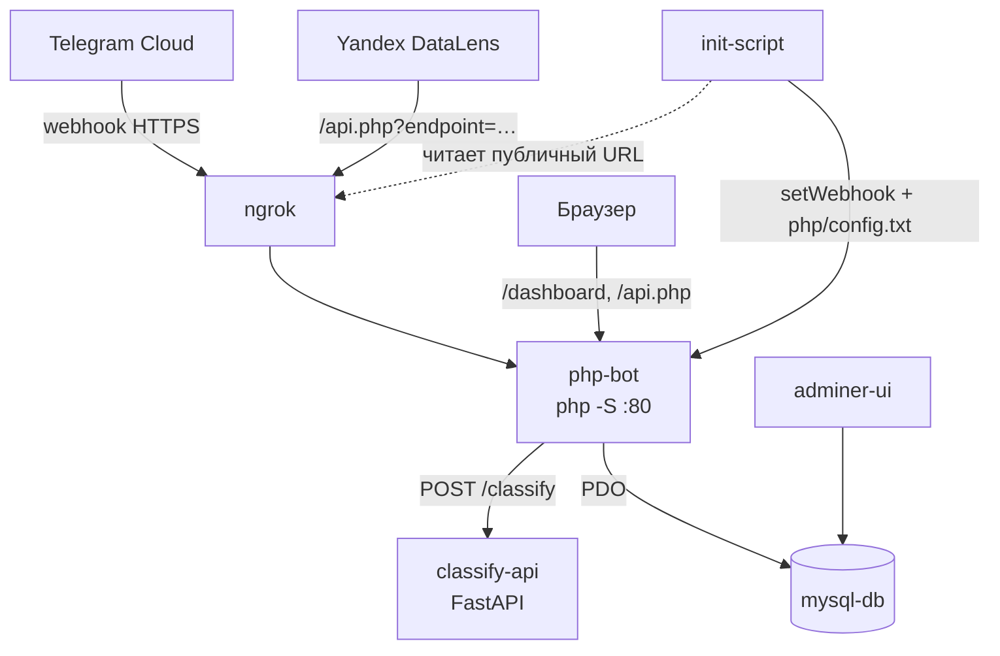

# telegram-bot — учёт расходов

Telegram-бот, который принимает траты обычным текстом («кофе 200, такси 300»),
раскладывает их по категориям zero-shot-классификатором и показывает статистику
в веб-дашборде. Дополнительно отдаёт REST API для Yandex DataLens.

Возможности:

- **Ввод трат текстом.** Одно сообщение — несколько трат через запятую. Категорию
  определяет ML-сервис, сумму — регулярка.
- **Пересланные сообщения.** Трата записывается датой оригинального сообщения
  (`forward_date`), а не датой пересылки.
- **Персональные категории.** Системные категории общие, свои — на пользователя;
  список уходит в классификатор, чтобы он выбирал из ваших категорий.
- **Лимиты.** По категории (`/setlimit`) и общий (`/setgloballimit`).
- **Веб-дашборд.** Круговая диаграмма по категориям, список трат, сравнение
  нескольких периодов, фильтры по датам, управление категориями.
- **Интеграция с Yandex DataLens.** [Быстрый старт](DATALENS_QUICKSTART.md) ·
  [полная инструкция](DATALENS_SETUP.md).

## Архитектура



| Контейнер | Папка | Технологии | Порт | Назначение |
|-----------|-------|------------|------|------------|
| **php-bot** | `php/` | PHP 7.4 CLI (встроенный сервер `php -S`), Smarty 5 | **8081** | Webhook Telegram, дашборд, REST API |
| **classify-api** | `python/` | Python 3.10, FastAPI, transformers (`joeddav/xlm-roberta-large-xnli`) | **8000** | Zero-shot классификация траты по тексту |
| **mysql-db** | `php/database/` | MySQL 5.7 | **3306** | Пользователи, категории, лимиты, история трат |
| **adminer-ui** | — | Adminer | **8080** | Веб-интерфейс к БД |
| **ngrok** | — | ngrok | **4040** | Публичный HTTPS-туннель к `php-bot` |
| **init-script** | — | curl + jq | — | Ставит webhook Telegram и генерирует `php/config.txt` |

Веб-сервер — встроенный сервер PHP, а не Apache, поэтому **rewrite-правил нет**.
Рабочие URL ровно такие: `/dashboard`, `/api.php?…`.

## Требования

- Docker и Docker Compose
- Токен Telegram-бота от [@BotFather](https://t.me/BotFather)
- Authtoken с [ngrok.com](https://ngrok.com) (личный кабинет → Your Authtoken)

## Установка и запуск

1. Клонируйте проект:
   ```bash
   git clone https://github.com/Mikhail-Konyukhov/telegram-bot/
   cd telegram-bot
   ```

2. Создайте `config.txt` из шаблона и впишите оба токена:
   ```bash
   cp config.example.txt config.txt
   ```
   ```
   TELEGRAM_BOT_TOKEN=ваш_токен_бота
   NGROK_AUTHTOKEN=ваш_ngrok_authtoken
   ```
   Файл в `.gitignore` — в репозиторий он не попадёт.

3. Установите PHP-зависимости (в git их нет):
   ```bash
   docker compose run --rm --build php composer install
   ```
   Composer пишет в `php/vendor/` на хосте — каталог `./php` смонтирован в контейнер,
   поэтому шаг нужен один раз после клонирования и после правок `composer.json`.

4. Запустите:
   ```bash
   start-docker.bat
   ```
   Скрипт вытащит токены из `config.txt`, положит их в `.env` и поднимет compose.
   На Linux/macOS создайте `.env` руками (`TELEGRAM_BOT_TOKEN`, `NGROK_AUTHTOKEN`)
   и выполните `docker compose up --build`.

Контейнер `init-script` сам дождётся HTTPS-адреса от ngrok, поставит webhook Telegram
и запишет `php/config.txt`. Отдельных действий не требуется.

### После запуска

| Что | Адрес |
|-----|-------|
| Бот и дашборд | http://localhost:8081 (дашборд — `/dashboard`) |
| Классификатор | http://localhost:8000 (`/health`, `/classify`, `/categories/default`) |
| Adminer | http://localhost:8080 |
| ngrok inspector | http://localhost:4040 |
| MySQL | `localhost:3306` |

Подключение в Adminer: сервер `mysql-db`, пользователь `root`, пароль `root`,
база `telegram_bot`. Само приложение ходит в БД под этой же учёткой
(см. [Database.php](php/src/App/Database.php)).

## Команды бота

| Команда | Что делает |
|---------|-----------|
| `/start`, `/help` | Регистрация и справка |
| `/dashboard` | Персональная ссылка на веб-дашборд (с токеном доступа) |
| `/categories` | Просмотр, добавление и удаление своих категорий |
| `/setlimit` | Лимит на конкретную категорию |
| `/setgloballimit` | Общий лимит на месяц |
| любой другой текст | Разбирается как траты: `название сумма` через запятую |

## API

### Внутренний API дашборда

`/api.php?user_id=<id>&token=<dashboard_token>&action=<action>` — токен обязателен,
без него ответ `403 Access denied`. Токен выдаёт `/dashboard` в боте.

| Метод | action | Назначение |
|-------|--------|-----------|
| GET | `expenses`, `categories`, `analytics_by_period` | Чтение |
| POST | `expense`, `category` | Создание |
| PUT | `expense` | Изменение траты |
| DELETE | `expense`, `category` | Удаление |

### API для DataLens

`/api.php?endpoint=<endpoint>` — без авторизации по умолчанию, endpoint'ы
`expenses`, `expenses-by-category`, `expenses-by-period`, `limits`,
`expenses-vs-limits`. Подробности — в [DATALENS_QUICKSTART.md](DATALENS_QUICKSTART.md)
и [DATALENS_SETUP.md](DATALENS_SETUP.md). Проверить локально:

```bash
test-datalens-api.bat     # Windows
./test-datalens-api.sh    # Linux/macOS (нужен jq)
```

## Схема БД

`php/database/init.sql` — таблицы `users`, `expenses`, `categories`, `limits`
плюс сид системных категорий (`user_id = 0`).

Скрипт выполняется **только при создании тома `mysql_data`**. Чтобы применить
изменения схемы, том нужно пересоздать:

```bash
docker compose down -v && docker compose up --build
```

## Подводные камни

- **ngrok выдаёт новый URL при каждом рестарте.** Webhook переставляет `init-script`,
  но если бот «молчит» — почти всегда дело в протухшем webhook. Проверка:
  `curl https://api.telegram.org/bot<TOKEN>/getWebhookInfo`.
- **`php/config.txt` генерируется заново на каждом `up`.** Ручные правки в нём
  не переживают перезапуск — включая `DATALENS_API_TOKEN`
  (см. [DATALENS_SETUP.md](DATALENS_SETUP.md#настройка-безопасности-опционально)).
  Корневой `config.txt` — другой файл, его читает только `start-docker.bat`.
- **Первый запрос к классификатору после `up` уходит в таймаут.** Контейнер
  скачивает и прогревает `xlm-roberta-large-xnli`; таймаут HTTP-клиента бота — 20 с.
  Кэш модели лежит в `~/.cache/huggingface` на хосте, так что дольше всего
  ждать придётся только в первый раз.
- **Что подхватывается без пересборки.** `./php` и `./data` смонтированы в `php-bot`,
  `./python` — в `classify-api`, `./php/database` — в `mysql-db`. PHP применяется сразу,
  Python — после `docker compose restart python` (uvicorn запущен без `--reload`).
  Правки `Dockerfile`, `requirements.txt` и `docker-compose.yml` требуют
  `docker compose up --build`.
- **Новая подпапка в `php/src/App/`** → `docker compose exec php composer dump-autoload`.
- **Кэш Smarty** в `php/src/App/templates_c/` не отдаёт свежий `.tpl` — при странном
  поведении дашборда чистите каталог.

## Разработка

```bash
docker compose logs -f php                          # логи бота и error_log()
docker compose exec php composer dump-autoload      # после добавления классов
docker compose down -v && docker compose up --build # полный сброс, включая БД
```

Автозагрузка — PSR-4, `App\` → `php/src/App/`. Имя файла совпадает с именем класса.
Код пишется под **PHP 7.4**: без `match`, `enum`, promoted constructor и `?->`.

## Планы

- [ ] Валидация данных во всех формах
- [ ] Внятная обработка ошибок и уведомления пользователю
- [ ] Логирование действий пользователей
- [ ] Индексы и оптимизация запросов (`user_id`, `ts`, `category`)
- [ ] Unit-тесты критичных компонентов
- [ ] Постоянный домен вместо ngrok для продакшена

Сделано ранее: управление категориями, расширенный дашборд (фильтры, сравнение
периодов, интерактивные диаграммы), учёт пересланных сообщений, интеграция с DataLens.
