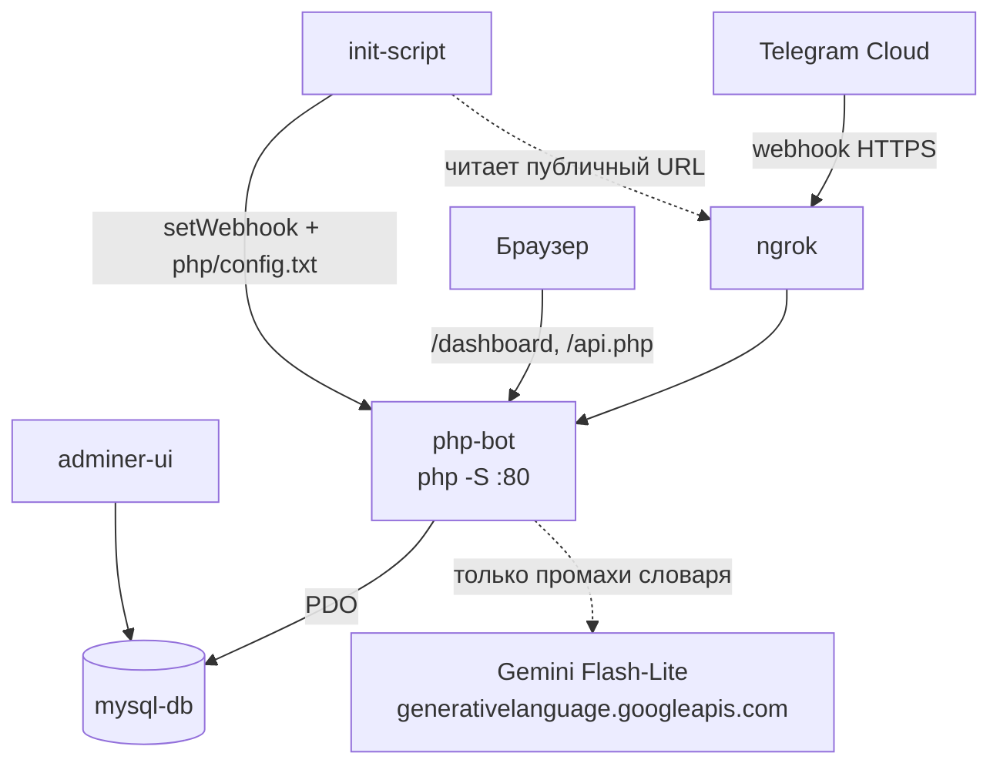

# telegram-bot — учёт расходов

Telegram-бот, который принимает траты обычным текстом («кофе 200, такси 300»),
раскладывает их по категориям и показывает статистику в веб-дашборде.

Возможности:

- **Ввод трат текстом.** Одно сообщение — несколько трат через запятую. Сумму
  определяет регулярка, категорию — каскад из словаря и Gemini (см. ниже).
- **Пересланные сообщения.** Трата записывается датой оригинального сообщения
  (`forward_date`), а не датой пересылки.
- **Персональные категории.** Системные категории общие, свои — на пользователя;
  модель выбирает только из категорий конкретного пользователя.
- **Лимиты.** По категории (`/setlimit`) и общий (`/setgloballimit`).
- **Веб-дашборд.** Круговая диаграмма по категориям, список трат, сравнение
  нескольких периодов, фильтры по датам, управление категориями.

## Архитектура



| Контейнер | Папка | Технологии | Порт | Назначение |
|-----------|-------|------------|------|------------|
| **php-bot** | `php/` | PHP 7.4 CLI (встроенный сервер `php -S`), Smarty 5 | **8081** | Webhook Telegram, дашборд, REST API |
| **mysql-db** | `php/database/` | MySQL 5.7 | **3306** | Пользователи, категории, лимиты, история трат, словарь категорий |
| **adminer-ui** | — | Adminer | **8080** | Веб-интерфейс к БД |
| **ngrok** | — | ngrok | **4040** | Публичный HTTPS-туннель к `php-bot` |
| **init-script** | — | curl + jq | — | Ставит webhook Telegram и генерирует `php/config.txt` |

Веб-сервер — встроенный сервер PHP, а не Apache, поэтому **rewrite-правил нет**.
Рабочие URL ровно такие: `/dashboard`, `/api.php?…`.

## Как определяется категория

Каскад из трёх уровней, дорогой шаг вызывается только на остатке:

1. **Личный словарь** — `category_hints` при `user_id` = ваш Telegram ID. Пополняется
   каждым сохранением траты и каждой правкой категории (кнопка «сменить категорию»
   в боте, редактирование в Mini App). Повторная покупка категорию угадывать не просит.
2. **Общий словарь** — те же строки при `user_id = 0`, накопленные всеми пользователями.
   Нужен ради холодного старта: новичок без своей истории сразу получает «такси»
   и «кофе». Хранится только пара «строка → категория», без привязки к тому, кто её ввёл.
3. **Gemini Flash-Lite** — всё, чего нет ни в одном словаре, уезжает **одним запросом
   на сообщение**. Ответ ограничен схемой (`responseSchema` + `enum` по категориям
   пользователя) и сразу попадает в словарь, чтобы второй раз за него не платить.

Названия перед поиском нормализуются ([NameNormalizer](php/src/App/Services/NameNormalizer.php)):
регистр, `ё→е`, пунктуация, количество и единицы. «Молоко 2 шт» и «молоко» — одна запись.

Если Gemini недоступен или ответил не по схеме, позиция не сохраняется, а пользователь
получает «Не удалось определить категорию для …». Уже разобранные позиции при этом
записываются — одна неудача не роняет всё сообщение.

## Требования

- Docker и Docker Compose
- Токен Telegram-бота от [@BotFather](https://t.me/BotFather)
- Authtoken с [ngrok.com](https://ngrok.com) (личный кабинет → Your Authtoken)
- API-ключ Gemini из [Google AI Studio](https://aistudio.google.com/apikey) —
  бесплатного тира хватает с большим запасом, карта не нужна

## Установка и запуск

1. Клонируйте проект:
   ```bash
   git clone https://github.com/Mikhail-Konyukhov/telegram-bot/
   cd telegram-bot
   ```

2. Создайте `config.txt` из шаблона и впишите все три ключа:
   ```bash
   cp config.example.txt config.txt
   ```
   ```
   TELEGRAM_BOT_TOKEN=ваш_токен_бота
   NGROK_AUTHTOKEN=ваш_ngrok_authtoken
   GEMINI_API_KEY=ваш_ключ_из_ai_studio
   ```
   Файл в `.gitignore` — в репозиторий он не попадёт.

3. Установите PHP-зависимости (в git их нет):
   ```bash
   docker compose run --rm --build php composer install
   ```
   Composer пишет в `php/vendor/` на хосте — каталог `./php` смонтирован в контейнер,
   поэтому шаг нужен один раз после клонирования и после правок `composer.json`.

4. Запустите:
   ```bash
   start-docker.bat
   ```
   Скрипт вытащит токены из `config.txt`, положит их в `.env` и поднимет compose.
   На Linux/macOS создайте `.env` руками (`TELEGRAM_BOT_TOKEN`, `NGROK_AUTHTOKEN`,
   `GEMINI_API_KEY`) и выполните `docker compose up --build`.

Контейнер `init-script` сам дождётся HTTPS-адреса от ngrok, поставит webhook Telegram
и запишет `php/config.txt`. Отдельных действий не требуется.

### После запуска

| Что | Адрес |
|-----|-------|
| Бот и дашборд | http://localhost:8081 (дашборд — `/dashboard`) |
| Adminer | http://localhost:8080 |
| ngrok inspector | http://localhost:4040 |
| MySQL | `localhost:3306` |

Подключение в Adminer: сервер `mysql-db`, пользователь `root`, пароль `root`,
база `telegram_bot`. Само приложение ходит в БД под этой же учёткой
(см. [Database.php](php/src/App/Database.php)).

## Команды бота

| Команда | Что делает |
|---------|-----------|
| `/start`, `/help` | Регистрация и справка |
| `/dashboard` | Персональная ссылка на веб-дашборд (с токеном доступа) |
| `/categories` | Просмотр, добавление и удаление своих категорий |
| `/setlimit` | Лимит на конкретную категорию |
| `/setgloballimit` | Общий лимит на месяц |
| любой другой текст | Разбирается как траты: `название сумма` через запятую |

## API дашборда

`/api.php?user_id=<id>&token=<dashboard_token>&action=<action>` — токен обязателен,
без него ответ `403 Access denied`. Токен выдаёт `/dashboard` в боте.

| Метод | action | Назначение |
|-------|--------|-----------|
| GET | `expenses`, `categories`, `analytics_by_period` | Чтение |
| POST | `expense`, `category` | Создание |
| PUT | `expense` | Изменение траты |
| DELETE | `expense`, `category` | Удаление |

## Схема БД

`php/database/init.sql` — таблицы `users`, `expenses`, `categories`, `limits`,
`category_hints` плюс сид системных категорий (`user_id = 0`).

Скрипт выполняется **только при создании тома `mysql_data`**. Чтобы применить
изменения схемы, том нужно пересоздать:

```bash
docker compose down -v && docker compose up --build
```

Если сбрасывать базу не хочется, разовые правки схемы лежат в
`php/database/migrations/` и накатываются вручную:

```bash
docker compose exec -T mysql mysql -uroot -proot telegram_bot \
  < php/database/migrations/001_category_hints.sql
```

## Подводные камни

- **ngrok выдаёт новый URL при каждом рестарте.** Webhook переставляет `init-script`,
  но если бот «молчит» — почти всегда дело в протухшем webhook. Проверка:
  `curl https://api.telegram.org/bot<TOKEN>/getWebhookInfo`.
- **`php/config.txt` генерируется заново на каждом `up`.** Ручные правки в нём
  не переживают перезапуск. Корневой `config.txt` — другой файл, его читает
  только `start-docker.bat`.
- **Категории определяются во внешнем API.** Без интернета или с протухшим
  `GEMINI_API_KEY` работают только словари: знакомые траты запишутся, незнакомые
  вернут ошибку. Причина видна в `docker compose logs -f php` — `GeminiClassifier`
  пишет туда и отказ запроса, и ответ не по схеме.
- **Что подхватывается без пересборки.** `./php` и `./data` смонтированы в `php-bot`,
  `./php/database` — в `mysql-db`. PHP применяется сразу. Правки `Dockerfile`
  и `docker-compose.yml` требуют `docker compose up --build`.
- **Новая подпапка в `php/src/App/`** → `docker compose exec php composer dump-autoload`.
- **Кэш Smarty** в `php/src/App/templates_c/` не отдаёт свежий `.tpl` — при странном
  поведении дашборда чистите каталог.

## Разработка

```bash
docker compose logs -f php                          # логи бота и error_log()
docker compose exec php composer dump-autoload      # после добавления классов
docker compose down -v && docker compose up --build # полный сброс, включая БД
```

Автозагрузка — PSR-4, `App\` → `php/src/App/`. Имя файла совпадает с именем класса.
Код пишется под **PHP 7.4**: без `match`, `enum`, promoted constructor и `?->`.

## Планы

- [ ] Валидация данных во всех формах
- [ ] Внятная обработка ошибок и уведомления пользователю
- [ ] Логирование действий пользователей
- [ ] Индексы и оптимизация запросов (`user_id`, `ts`, `category`)
- [ ] Unit-тесты критичных компонентов
- [ ] Постоянный домен вместо ngrok для продакшена

Сделано ранее: управление категориями, расширенный дашборд (фильтры, сравнение
периодов, интерактивные диаграммы), учёт пересланных сообщений.
