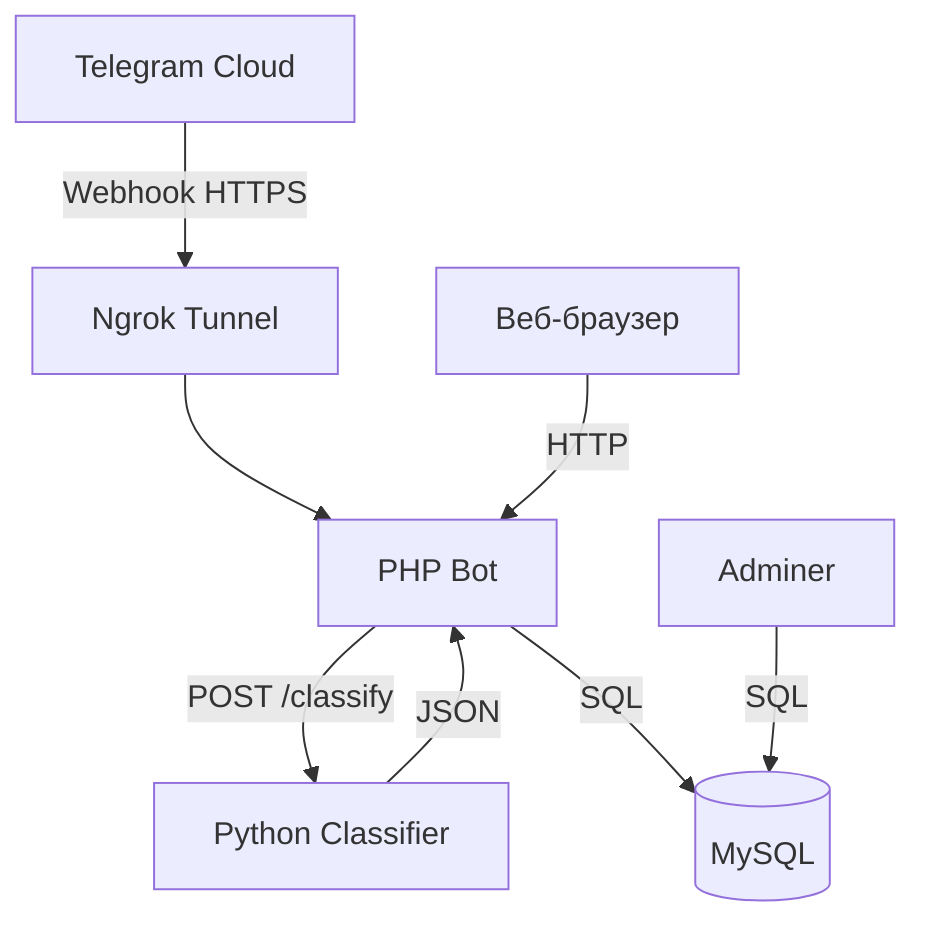

# telegram-bot

- **Автоматическая классификация расходов**: Бот может обрабатывать сообщения с расходами в формате "название суммы", например "кофе 200, такси 300". Расходы автоматически классифицируются по категориям с помощью нейросети.

- **Веб-дашборд**: Просмотр расходов по категориям в виде диаграммы и таблицы с фильтрацией по датам.

- **Интеграция с Yandex DataLens**: REST API для визуализации данных о расходах в Yandex DataLens с поддержкой агрегации по категориям, периодам и сравнения с лимитами. См. [быстрый старт](DATALENS_QUICKSTART.md) или [полную инструкцию](DATALENS_SETUP.md).

## Структура проекта
Проект состоит из нескольких компонентов:

1. **PHP Bot**: обрабатывает запросы от Telegram, взаимодействует с базой данных и веб-дашборд.
2. **Python Classifier**: микросервис для автоматической классификации расходов по категориям.
3. **MySQL**: хранит информацию о пользователях, их балансах и расходах.
4. **Adminer**: веб-интерфейс для управления базой данных.

Ниже приведена детализированная таблица с характеристиками каждого сервиса и соответствующей директории в репозитории:

| Контейнер | Папка | Технологии | Порт | Назначение |
|-----------|-------|------------|------|------------|
| **php-bot** | `php/` | PHP 8.x, Apache, Smarty | **8081** | Принимает веб-хуки Telegram, рендерит веб-дашборд и предоставляет REST-API для фронтенда и ML-сервиса |
| **python-classifier** | `python/` | Python 3.x, FastAPI, scikit-learn | **8000** | ML-сервис, который определяет категорию траты по тексту сообщения |
| **mysql-db** | `database/` | MySQL 8 | **3306** | Хранит пользователей, категории, лимиты и историю трат |
| **adminer** | — | Adminer (PHP) | **8080** | Визуальный интерфейс для администрирования базы данных |
| **ngrok** | `ngrok/` | Ngrok | **4040** | Создаёт публичный HTTPS-туннель к локальному `php-bot` и дашборду |

### Схема взаимодействия сервисов



Такое представление помогает быстро понять роль каждой части системы и то, как они взаимодействуют друг с другом.

## Требования
Для разворачивания проекта необходимы:

1. Docker
2. Docker Compose

## Инструкция по локальной установке
1. Клонируйте проект на вашу машину: 
   ```bash
   git clone https://github.com/Mikhail-Konyukhov/telegram-bot/
   cd telegram-bot
   ```
2. В файле `config.txt` укажите токены:
   ```
   TELEGRAM_BOT_TOKEN=your_telegram_bot_token
   NGROK_AUTHTOKEN=your_ngrok_auth_token
   ```
   
   **Получение NGROK_AUTHTOKEN**:
   - Зарегистрируйтесь на [ngrok.com](https://ngrok.com)
   - В личном кабинете скопируйте свой Authtoken
   
3. Запустить проект одной командой:
   ```bash
   start-docker.bat
   ```
   или
   ```bash
   docker-compose up --build
   ```
   
   **Проект автоматически**:
   - Настроит ngrok туннель
   - Установит webhook для Telegram бота
   - Запустит все сервисы
   
   После запуска контейнеров:
   - PHP Bot будет доступен по адресу: http://localhost:8081
   - Python Classifier будет доступен по адресу: http://localhost:8000
   - MySQL будет работать на порту 3306
   - Adminer будет доступен по адресу: http://localhost:8080
   - Ngrok Web Interface: http://localhost:4040 (для просмотра публичного URL)
   
   Данные для авторизации в Adminer:
   - Сервер: mysql-db
   - Имя пользователя: user	
   - Пароль: password

## План доработок функционала

### 1. Улучшение системы классификации (Python-модуль)
**Текущее состояние**: Категории жестко заданы в коде Python (`categories = ["еда", "транспорт", ...]`)

**Планируемые изменения**:
- [x] Передача категорий из PHP-бэкенда в Python-микросервис через API
- [x] Добавление endpoint'а для управления категориями в Python API
- [x] Создание интерфейса в PHP для добавления/редактирования категорий пользователем
- [x] Сохранение пользовательских категорий в базе данных MySQL
- [x] Реализация персонализированных категорий для каждого пользователя

**Файлы для изменения**:
- `python/main.py` - изменение логики получения категорий
- `php/src/App/Models/Category.php` - новая модель для работы с категориями
- `php/src/App/Controllers/Handlers/CategoryHandler.php` - обработчик команд категорий
- `database/init.sql` - добавление таблицы categories

### 2. Расширение функционала дашборда (PHP-модуль)
**Текущее состояние**: ✅ **ЗАВЕРШЕНО**

**Реализованные изменения**:
- [x] **Улучшенная фильтрация по датам**:
  - Добавлены кнопки "За этот месяц" (с начала текущего месяца) 
  - Добавлены кнопки "Эта неделя" (с ближайшего понедельника)
  
- [x] **Интерфейс управления категориями**:
  - Просмотр всех категорий пользователя (системные + персональные)
  - Добавление новых персональных категорий
  - Удаление персональных категорий через веб-интерфейс
  
- [x] **Интерактивность диаграмм**:
  - Кнопка "Скрыть" в списке трат для исключения из диаграммы
  - Динамическое обновление диаграммы при скрытии трат
  
- [x] **Детальный список трат**:
  - Отображение детального списка всех трат с датой, категорией, названием
  - Возможность скрытия отдельных трат
  - AJAX-операции без перезагрузки страницы
  
- [x] **Сравнительная диаграмма**:
  - Сравнение трат по нескольким периодам (дни/недели/месяцы)
  - Выбор количества периодов для сравнения (2-24)
  - Фильтрация по выбранным категориям
  - Столбчатая диаграмма динамики трат

**Файлы для изменения**:
- `php/src/App/templates/dashboard.tpl` - расширение шаблона
- `php/src/App/Controllers/DashboardController.php` - новые методы
- `php/src/App/Services/DashboardService.php` - расширение сервиса
- `php/src/App/Controllers/ExpenseApiController.php` - новый API контроллер

### 3. Улучшение обработки пересланных сообщений (Telegram Bot)
**Текущее состояние**: ✅ **ЗАВЕРШЕНО**

**Реализованные изменения**:
- [x] Определение пересланных сообщений через Telegram API
- [x] Извлечение даты оригинального сообщения из forward_date
- [x] Сохранение трат с датой оригинального сообщения
- [x] Обработка случаев, когда forward_date недоступен (fallback на дату получения)

**Файлы для изменения**:
- `php/src/App/Controllers/Handlers/ExpenseHandler.php` - логика определения даты
- `php/src/App/Models/Expense.php` - возможные изменения в методах сохранения

### 4. Интеграция с Yandex DataLens
**Текущее состояние**: ✅ **ЗАВЕРШЕНО**

**Реализованные изменения**:
- [x] **REST API endpoint'ы для DataLens**:
  - Выгрузка всех расходов с фильтрацией по датам
  - Агрегация расходов по категориям
  - Агрегация по периодам (день/неделя/месяц)
  - Выгрузка лимитов
  - Сравнение расходов и лимитов

- [x] **Безопасность**:
  - Опциональная авторизация через Bearer токен
  - CORS заголовки для кросс-доменных запросов

- [x] **Документация**:
  - Полная инструкция по настройке DataLens
  - Примеры запросов и визуализаций
  - Решение типовых проблем

**Файлы**:
- `php/src/App/Controllers/DataLensApiController.php` - контроллер API
- `php/src/App/Models/Expense.php` - методы агрегации данных
- `php/src/App/Models/Limit.php` - методы выгрузки лимитов
- `php/api.php` - роутинг для DataLens
- `DATALENS_SETUP.md` - инструкция по настройке

### 5. Дополнительные улучшения
**Планируемые доработки**:
- [ ] Добавление валидации данных во всех формах
- [ ] Улучшение обработки ошибок и уведомлений пользователя
- [ ] Добавление логирования действий пользователей
- [ ] Оптимизация запросов к базе данных
- [ ] Добавление unit-тестов для критических компонентов
- [ ] Документация API для всех endpoint'ов

---

**Приоритет реализации**: 
1. ~~Система управления категориями (пункт 1)~~ ✅
2. ~~Расширение дашборда (пункт 2)~~ ✅
3. ~~Обработка пересланных сообщений (пункт 3)~~ ✅
4. ~~Интеграция с Yandex DataLens (пункт 4)~~ ✅
5. Дополнительные улучшения (пункт 5)
