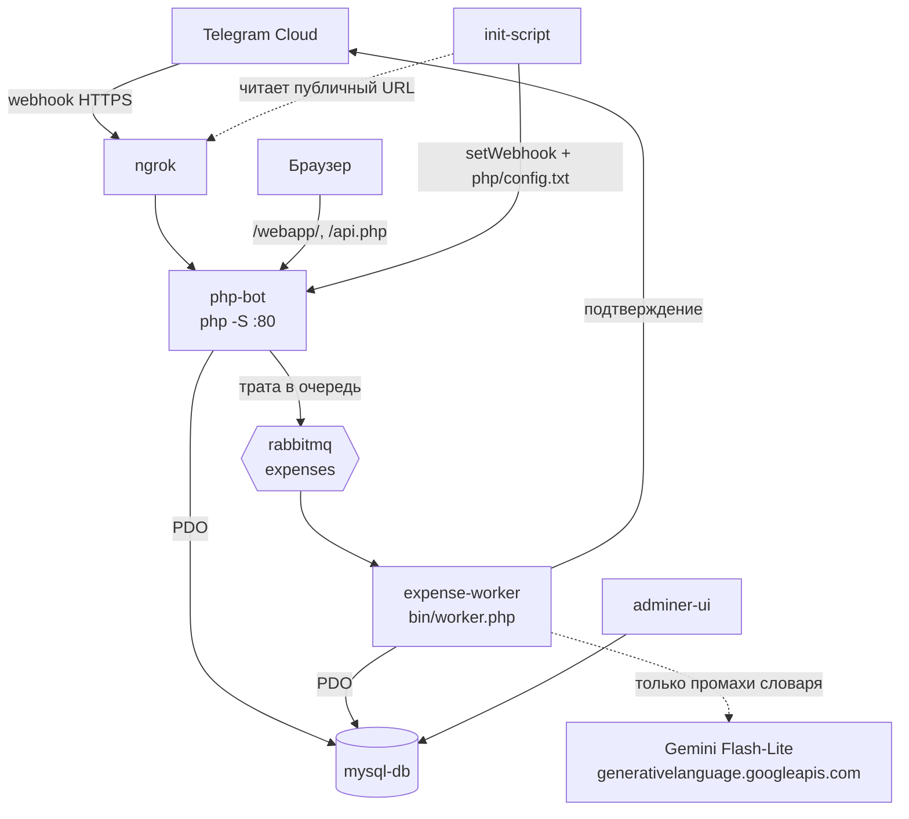

# telegram-bot — учёт расходов

Telegram-бот, который принимает траты обычным текстом («кофе 200, такси 300»),
раскладывает их по категориям и показывает статистику в веб-дашборде.

Возможности:

- **Ввод трат текстом.** Одно сообщение — несколько трат через запятую. Сумму
  определяет регулярка, категорию — каскад из словаря и Gemini (см. ниже).
- **Пересланные сообщения.** Трата записывается датой оригинального сообщения
  (`forward_date`), а не датой пересылки.
- **Персональные категории.** Системные категории общие, свои — на пользователя;
  модель выбирает только из категорий конкретного пользователя.
- **Лимиты.** По категории (`/setlimit`) и общий (`/setgloballimit`).
- **Веб-дашборд.** Круговая диаграмма по категориям, список трат, сравнение
  нескольких периодов, фильтры по датам, управление категориями.

## Архитектура



| Контейнер | Папка | Технологии | Порт | Назначение |
|-----------|-------|------------|------|------------|
| **php-bot** | `php/` | PHP 8.2 CLI (встроенный сервер `php -S`) | **8081** | Webhook Telegram, Mini App, REST API |
| **expense-worker** | `php/bin/` | тот же образ, `php bin/worker.php` | — | Разбирает траты из очереди, классифицирует, отвечает пользователю |
| **rabbitmq** | — | RabbitMQ 3.13 | **5672**, **15672** | Очередь трат: `expenses`, `expenses.retry`, `expenses.dead` |
| **mysql-db** | `php/database/` | MySQL 5.7 | **3306** | Пользователи, категории, лимиты, история трат, словарь категорий |
| **adminer-ui** | — | Adminer | **8080** | Веб-интерфейс к БД |
| **ngrok** | — | ngrok | **4040** | Публичный HTTPS-туннель к `php-bot` |
| **init-script** | — | curl + jq | — | Ставит webhook Telegram и генерирует `php/config.txt` |

Веб-сервер — встроенный сервер PHP, а не Apache, поэтому **rewrite-правил нет**.
Рабочие URL ровно такие: `/webapp/`, `/api.php?…`.

### Почему траты идут через очередь

Разбор траты ходит в Gemini, а вебхук обязан ответить Telegram быстро — иначе тот
считает доставку неудачной и присылает апдейт заново. Раньше это закрывало дорогу
повторным попыткам: `sleep` внутри вебхука приводил к тому, что трата записывалась
дважды. Теперь вебхук только публикует сообщение, а всё остальное делает воркер,
и появляется то, чего в вебхуке быть не могло:

- **Ограничение темпа.** Ключ Gemini один на всех пользователей, и лимит у него
  на ключ. Потребитель очереди один и берёт по сообщению за раз, поэтому
  выдержать паузу (`GEMINI_MIN_INTERVAL_MS`) достаточно в нём одном.
- **Отложенные повторы.** На `429` и `5xx` сообщение уходит в `expenses.retry`,
  лежит там минуту и возвращается в работу. После пяти неудач — в `expenses.dead`,
  пользователю уходит внятная ошибка. Неверный ключ или ответ не по схеме
  не повторяются вовсе: их повтор ничего не изменит.
- **Защита от повторной доставки.** Очередь доставляет at-least-once, поэтому
  `update_id` записывается в `processed_updates` в одной транзакции с тратами.

Если RabbitMQ недоступен, бот не теряет траты: публикация падает, и сообщение
разбирается синхронно, как раньше.

## Книга трат: личная и групповая

**Книга = чат.** В личке владелец книги — вы, в группе — сама группа: бот пишет
траты под `chat_id`, поэтому в общей беседе получается один семейный бюджет
без отдельной сущности «домохозяйство». Категории и лимиты тоже принадлежат книге.

Чтобы это работало в группе, нужны три вещи:

1. **Отключить privacy mode** у @BotFather: `/setprivacy` → бот → **Disable**.
   Иначе бот в группе видит только команды и не получит сообщение «кофе 300».
2. **Завести direct link Mini App**: @BotFather → `/newapp` → бот → короткое имя.
   Полученную ссылку `https://t.me/ваш_бот/приложение` положить в `MINIAPP_LINK`.
   Кнопки типа `web_app` Telegram в группах не показывает вообще — только такие ссылки.
3. Позвать бота в группу и отправить `/app` — он пришлёт кнопку на общий бюджет.

Какую книгу открывать, приложение узнаёт из `?startapp=<id чата>`. Значение задаёт
клиент, поэтому подпись `initData` тут ничего не доказывает: право на чужую книгу
проверяется отдельно, запросом `getChatMember` к Telegram
([LedgerResolver](php/src/App/Services/LedgerResolver.php)). Результат кэшируется
на час в `chat_members`, чтобы не ходить в API на каждый запрос приложения.
Книги с неотрицательным id считаются личными и чужому не отдаются никогда.

## Как определяется категория

Каскад, дорогой шаг вызывается только на остатке:

1. **Точное совпадение в словаре** — `category_hints`, сначала личный (`user_id` =
   ваш Telegram ID или id группы), затем общий (`user_id = 0`). Личный пополняется
   каждым сохранением траты и каждой правкой категории (кнопка «сменить категорию»
   в боте, редактирование в Mini App). Повторная покупка категорию угадывать не просит.
   Общий нужен ради холодного старта: новичок без своей истории сразу получает
   «такси» и «кофе».
2. **Совпадение по слову** — если строка целиком не нашлась, она разбирается на слова
   и каждое ищется в словаре. Так «молоко простоквашино 3.2%» находит запись «молоко»,
   а «пятёрочка молоко хлеб» — любую из трёх. Побеждает личная запись, при равенстве —
   более длинная, как более конкретная. Этот уровень и делает большой словарь полезным:
   без него запись «молоко» ловила бы только слово «молоко» и ничего больше.
3. **Gemini Flash-Lite** — всё, чего нет ни в одном словаре, уезжает **одним запросом
   на сообщение**. Ответ ограничен схемой (`responseSchema` + `enum` по категориям
   пользователя) и сразу попадает в словарь, чтобы второй раз за него не платить.

Названия перед поиском нормализуются ([NameNormalizer](php/src/App/Services/NameNormalizer.php)):
регистр, `ё→е`, пунктуация, количество и единицы. «Молоко 2 шт» и «молоко» — одна запись.

Общий словарь наполняется из CSV, отдельно от того, что накапливают пользователи:

```bash
docker compose exec php php bin/import-hints.php
```

Файл — [php/database/hints.csv](php/database/hints.csv), формат `название;категория`.
Записи должны быть **короткими, в одно-два слова**: поиск по слову сопоставляет слова
ввода с целыми записями словаря, поэтому «молоко» полезно, а «молоко питьевое
пастеризованное 3.2%» не поймает ничего. Категории обязаны совпадать с системными —
остальные строки импортёр отбросит и посчитает. Пишет `INSERT IGNORE`, то есть
накопленное пользователями не затирает.

Если Gemini недоступен или ответил не по схеме, позиция не сохраняется, а пользователь
получает «Не удалось определить категорию для …». Уже разобранные позиции при этом
записываются — одна неудача не роняет всё сообщение.

## Требования

- Docker и Docker Compose
- Токен Telegram-бота от [@BotFather](https://t.me/BotFather)
- Authtoken с [ngrok.com](https://ngrok.com) (личный кабинет → Your Authtoken)
- API-ключ Gemini из [Google AI Studio](https://aistudio.google.com/apikey) —
  бесплатного тира хватает с большим запасом, карта не нужна

## Установка и запуск

1. Клонируйте проект:
   ```bash
   git clone https://github.com/Mikhail-Konyukhov/telegram-bot/
   cd telegram-bot
   ```

2. Создайте `config.txt` из шаблона и впишите все три ключа:
   ```bash
   cp config.example.txt config.txt
   ```
   ```
   TELEGRAM_BOT_TOKEN=ваш_токен_бота
   NGROK_AUTHTOKEN=ваш_ngrok_authtoken
   GEMINI_API_KEY=ваш_ключ_из_ai_studio
   ```
   Файл в `.gitignore` — в репозиторий он не попадёт.

3. Установите PHP-зависимости (в git их нет):
   ```bash
   docker compose run --rm --build php composer install
   ```
   Composer пишет в `php/vendor/` на хосте — каталог `./php` смонтирован в контейнер,
   поэтому шаг нужен один раз после клонирования и после правок `composer.json`.

4. Запустите:
   ```bash
   start-docker.bat
   ```
   Скрипт вытащит токены из `config.txt`, положит их в `.env` и поднимет compose.
   На Linux/macOS создайте `.env` руками (`TELEGRAM_BOT_TOKEN`, `NGROK_AUTHTOKEN`,
   `GEMINI_API_KEY`) и выполните `docker compose up --build`.

Контейнер `init-script` сам дождётся HTTPS-адреса от ngrok, поставит webhook Telegram
и запишет `php/config.txt`. Отдельных действий не требуется.

### После запуска

| Что | Адрес |
|-----|-------|
| Бот, Mini App и API | http://localhost:8081 — Mini App на `/webapp/`, API на `/api.php` |
| Adminer | http://localhost:8080 |
| RabbitMQ, веб-морда | http://localhost:15672 — `guest` / `guest` |
| ngrok inspector | http://localhost:4040 |
| MySQL | `localhost:3306` |

Mini App открывается только из Telegram: без заголовка `X-Telegram-Init-Data`
API отвечает `403`, а сам `initData` выдаёт клиент Telegram. В браузере
по прямой ссылке будет пустой экран — это не поломка.

Подключение в Adminer: сервер `mysql-db`, пользователь `root`, пароль `root`,
база `telegram_bot`. Само приложение ходит в БД под этой же учёткой
(см. [Database.php](php/src/App/Database.php)).

## Команды бота

| Команда | Что делает |
|---------|-----------|
| `/start`, `/help` | Регистрация и справка |
| `/app` | Кнопка на Mini App. `/dashboard` — старый алиас той же команды |
| `/categories` | Просмотр, добавление и удаление своих категорий |
| `/setlimit` | Лимит на конкретную категорию |
| `/setgloballimit` | Общий лимит на месяц |
| любой другой текст | Разбирается как траты: `название сумма` через запятую |

## API Mini App

`/api.php?action=<action>`, авторизация — заголовок `X-Telegram-Init-Data`
с подписанным `initData` от Telegram. Подпись проверяется в
[TelegramAuth](php/src/App/Services/TelegramAuth.php) (HMAC по `WebAppData`,
свежесть `auth_date` 24 часа), без валидной подписи ответ `403 Access denied`.
Токена в URL больше нет: он утекал в историю чата и в логи прокси.

Какую книгу трат открывать, приложение передаёт в `?startapp=<id чата>`;
право на чужую книгу проверяет [LedgerResolver](php/src/App/Services/LedgerResolver.php),
а не подпись.

| Метод | action | Назначение |
|-------|--------|-----------|
| GET | `overview` | Весь экран «Обзор» одним запросом, со сравнением периодов |
| GET | `expenses`, `categories`, `limits`, `analytics_by_period` | Чтение |
| GET | `suggestions` | Частые позиции для подсказок в форме |
| POST | `expense`, `category`, `limit` | Создание |
| POST | `expense_smart` | Разбор строки «кофе 300, такси 450» целиком |
| PUT | `expense` | Изменение траты, поля частичные |
| DELETE | `expense`, `category`, `limit` | Удаление |

## Схема БД

`php/database/init.sql` — таблицы `users`, `expenses`, `categories`, `limits`,
`category_hints` плюс сид системных категорий (`user_id = 0`).

Скрипт выполняется **только при создании тома `mysql_data`**. Чтобы применить
изменения схемы, том нужно пересоздать:

```bash
docker compose down -v && docker compose up --build
```

Если сбрасывать базу не хочется, разовые правки схемы лежат в
`php/database/migrations/` и накатываются вручную:

```bash
docker compose exec -T mysql mysql --default-character-set=utf8mb4 -uroot -proot telegram_bot \
  < php/database/migrations/001_category_hints.sql
```

Порядок и назначение: `001` — словарь категорий, `002` — сид системных категорий,
`003` — кэш членства в группах, `004` — индекс `(user_id, ts)` на `expenses`,
`005` — `processed_updates` для дедупликации апдейтов. Каждый файл в шапке несёт
команду запуска и пометку, идемпотентен ли он (`004` — нет: MySQL 5.7 не умеет
`CREATE INDEX IF NOT EXISTS`).

## Подводные камни

- **ngrok выдаёт новый URL при каждом рестарте.** Webhook переставляет `init-script`,
  но если бот «молчит» — почти всегда дело в протухшем webhook. Проверка:
  `curl https://api.telegram.org/bot<TOKEN>/getWebhookInfo`.
- **`php/config.txt` генерируется заново на каждом `up`.** Ручные правки в нём
  не переживают перезапуск. Корневой `config.txt` — другой файл, его читает
  только `start-docker.bat`.
- **Категории определяются во внешнем API.** Без интернета или с протухшим
  `GEMINI_API_KEY` работают только словари: знакомые траты запишутся, незнакомые
  вернут ошибку. Разбор идёт в воркере, поэтому смотреть надо
  `docker compose logs -f worker`, а не логи `php` — там останется только публикация
  в очередь.
- **Трата «пропала» — сначала посмотрите очередь.** Если воркер лежит, сообщения
  копятся в `expenses`, а бот молчит: вебхук-то ответил успешно. Веб-морда RabbitMQ
  на http://localhost:15672 (guest/guest) показывает и накопившееся, и застрявшее
  в `expenses.retry`.
- **Что подхватывается без пересборки.** `./php` и `./data` смонтированы в `php-bot`
  и `expense-worker`, `./php/database` — в `mysql-db`. PHP в `php-bot` применяется
  сразу, а **воркер — процесс долгоживущий и правки сам не подхватит**: нужен
  `docker compose restart worker`. Правки `Dockerfile` и `docker-compose.yml`
  требуют `docker compose up --build`.
- **Новая подпапка в `php/src/App/`** → `docker compose exec php composer dump-autoload`.

## Прод

Отдельный компоуз [docker-compose.prod.yml](docker-compose.prod.yml): вместо ngrok —
постоянный домен и [Caddy](Caddyfile) с автоматическим HTTPS, вместо
`config.txt` — переменные окружения из `.env` на сервере (шаблон —
[.env.prod.example](.env.prod.example)).

```bash
docker compose -f docker-compose.prod.yml up -d --build
```

Наружу смотрит только Caddy на 80 и 443. Adminer слушает `127.0.0.1:8080`
и доступен через SSH-туннель, у MySQL и RabbitMQ публикации портов нет вообще —
`ports` в компоузе идут мимо цепочки `INPUT`, поэтому фаервол их не закрыл бы.
У RabbitMQ в проде образ без плагина управления: веб-морда стоит памяти.

Как это устроено и почему именно так — [DEPLOY.md](DEPLOY.md): сокеты и bind,
DNS и TTL, netfilter и `DOCKER-USER`, ACME и выпуск сертификата, разбор отказов.

## Разработка

```bash
docker compose logs -f php                          # вебхук и публикация в очередь
docker compose logs -f worker                       # разбор трат, Gemini, ошибки
docker compose restart worker                       # после правок кода воркера
docker compose exec php composer dump-autoload      # после добавления классов
docker compose down -v && docker compose up --build # полный сброс, включая БД
```

Автозагрузка — PSR-4, `App\` → `php/src/App/`. Имя файла совпадает с именем класса.
Код пишется под **PHP 8.2** (см. `config.platform.php` в `php/composer.json`).

## Планы

- [ ] Валидация данных во всех формах
- [ ] Внятная обработка ошибок и уведомления пользователю
- [ ] Логирование действий пользователей
- [ ] Unit-тесты критичных компонентов
- [ ] Расширить общий словарь: `hints.csv` пока стартовый, 172 записи

Сделано ранее: управление категориями, Mini App вместо дашборда, учёт пересланных
сообщений, общая книга трат на группу, постоянный домен вместо ngrok в проде,
индекс `(user_id, ts)` на `expenses`, очередь на RabbitMQ с повторами.
